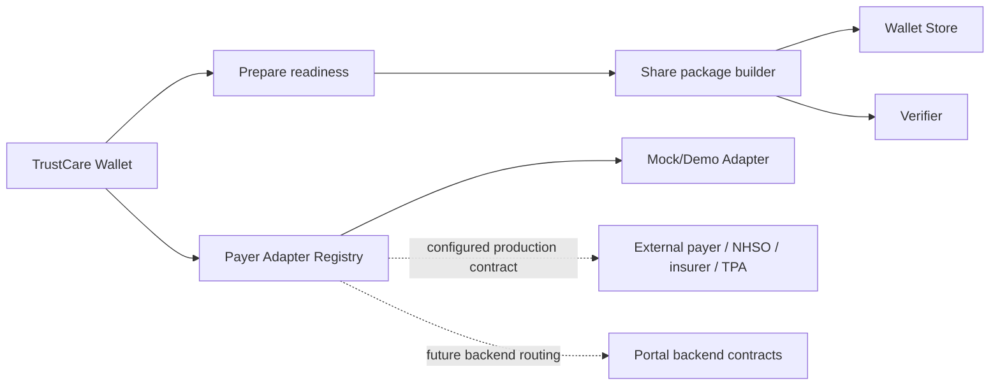

# CarePass Payer, e-Claim, Cross-Border, and Medical Tourist Handoff

This repository implements the wallet-side foundation for payer, e-Claim, insurance eligibility, pre-authorization, claim package, cross-border patient summary, and medical tourist support.

The implementation must follow the current TrustCare Wallet architecture:

- Patient-held wallet records remain the UX source for cards, credentials, readiness, sharing, store, and verifier flows.
- VC/VP, OID4VCI, OID4VP, SMART Health Links, Certified SHL Manifest Package, Contract Hub, canonical document types, and readiness contexts remain the foundation.
- Payer/e-Claim logic is an orchestration and adapter layer only.
- The payer remains the source of eligibility, pre-auth, claim, guarantee, payment, and rejection decisions.

## Architecture

## Wallet Scope

The wallet can:

- Discover mock/demo coverage candidates.
- Verify eligibility through a configured adapter.
- Request pre-authorization through a configured adapter.
- Build a claim evidence package without adjudicating the claim.
- Submit a claim package to a demo or production adapter.
- Store claim receipts, claim status credentials, eligibility results, guarantee letters, quotation, visa support, and medical tourist documents as canonical wallet documents.
- Choose VP or Certified SHL Manifest Package based on service context and package size.
- Preserve consent IDs, holder DID, expiry, warnings, and payer references.

The wallet must not:

- Hard-code real NHSO, ThaiD, insurer, or TPA endpoints.
- Decide whether a payer should approve or reject a claim.
- Calculate proprietary benefit or payment rules.
- Treat mock responses as production payer decisions.

## Service Profiles

The current wallet already has readiness contexts for:

- `insurance_claim`
- `cross_border`
- `medical_tourist`

The payer foundation extends these contexts with typed payer adapter results, claim package construction, and demo API functions.

## Canonical Documents

The wallet should use existing canonical document types first:

- `insurance_eligibility`
- `claim_package`
- `claim_receipt`
- `travel_document_verification`
- `visa_support_letter`
- `quotation`
- `guarantee_letter`
- `patient_summary`
- `referral_vc`
- `consent_receipt`

New UI surfaces must render through existing credential/card renderers where possible.

## Implementation Notes

- Demo mode starts in `packages/wallet-core/src/payer` and `packages/api-client/src/payer.ts`.
- Production connectors belong behind adapter config and backend routing.
- The API client should expose typed facade functions without embedding real payer URLs.
- Tests should cover mock adapter mapping, readiness contexts, share package selection, claim package creation, and medical tourist guarantee flow.

